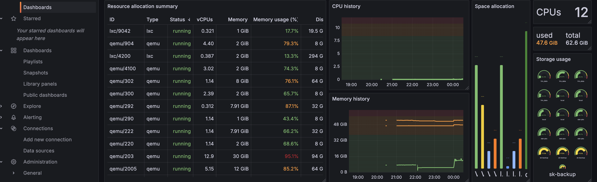

# Prometheus Grafana for Proxmox API

This repository contains a service for monitoring proxmox cluster from API. The service consists of the following components:

- **Grafana**: Visualization tool used for creating dashboards and analyzing metrics collected by Prometheus.
- **Prometheus**:  A time-series database and monitoring tool that scrapes and stores metrics data from various targets, including Proxmox and local servers.
- **Pve-exporter**: A plugin for gathering metrics from the Proxmox API. It collects detailed information about Proxmox clusters, including CPU, memory, storage usage, and virtual machine performance.
- **Node_exporter**: A lightweight exporter that gathers hardware and OS-level metrics from the local server where Prometheus is installed. 

## Table of Contents

- [Creating a User with PAM Authentication](#creating-a-user-with-pam-authentication)
  - [Create a User with PAM Authentication](#step-1-create-a-user-with-pam-authentication)
  - [Assign Permissions (PVEAudit)](#step-2-assign-permissions-pveaudit)
  - [Create an API Token for the User](#step-3-create-an-api-token-for-the-user)
- [Configuration Files](#configuration-files)
  - [Prometheus Configuration](#step-4-prometheus-configuration)
  - [PVE Exporter Configuration](#step-5-pve-exporter-configuration)
- [Running the Services](#running-the-services)
  - [Run the Containers](#step-6-run-the-containers)
  - [Verifying the Services](#step-7-verifying-the-services)
- [Setuping Grafana](#setuping-grafana)
  - [Logging into Grafana](#step-8-logging-into-grafana)
  - [Adding a Prometheus Data Source](#step-9-adding-a-prometheus-data-source)
  - [Importing Dashboards](#step-10-importing-dashboards)
- [Project Structure](#project-structure)
- [Conclusion](#conclusion)


## Creating a User with PAM Authentication:


### Step 1: Create a User with PAM Authentication

1. **Log in to the Proxmox web interface** as an administrator.
2. In the left navigation pane, go to **Datacenter** and then click on **Permissions** > **Users**.
3. Click the **Add** button at the top of the users list.
4. In the **Add User** window, fill in the following details:
   - **User Name**: Enter a username, for example `pve-exporter`.
   - **Realm**: Select `pam` from the dropdown (this means the user will authenticate using PAM).
   - **Password**: Set a password for the user.
5. Click **Add** to create the user.

### Step 2: Assign Permissions (PVEAudit)

1. After creating the user, go to **Datacenter** in the left pane.
2. Click on **Permissions** > **Add** > **User Permission**.
3. In the **Add Permission** window:
   - **Path**: Set the path to `/` or choose a specific node or VM for which you want the user to have access.
   - **User**: Select the user you just created (`pve-exporter@pam`).
   - **Role**: From the dropdown, select `PVEAudit`. This role allows read-only access to most of the cluster's information, suitable for monitoring purposes.
4. Click **Add** to assign the permissions.

### Step 3: Create an API Token for the User

1. Go to **Permissions** > **Users**, and find the user you created (`pve-exporter@pam`).
2. Select the user and click on **API Tokens** in the lower pane.
3. Click the **Add** button at the top to create a new API token.
4. In the **Add API Token** window:
   - **Token Name**: Enter a name for the token (e.g., `exporter`).
   - **Comment**: Optionally add a comment for documentation purposes.
   - **Expire**: You can leave this as `never` or set an expiration date for the token.
5. Click **Add** to create the token.

Once the token is created, you will see it in the list. Be sure to save the token somewhere secure, as it will be needed for `pve-exporter` to access the API.

---
## Configuration Files

###  Step 4: Prometheus Configuration

In the `prometheus/prometheus.yml` file, add the addresses of the Proxmox nodes you want to monitor.

If you are using IP addresses instead of domain names, make sure to disable SSL verification in the next step by setting `verify_ssl: false`.

Here is an example of what the configuration might look like:

```
scrape_configs:
    static_configs:
      - targets:
        - node1.example.com   # type here Proxmox VE node1 ip address or domain name
        - node2.example.com   # type here Proxmox VE node2 ip address or domain name
        - node3.example.com   # type here Proxmox VE node3 ip address or domain name 
```


Replace `node1.example.com`, `node2.example.com`, and `node3.example.com` with the actual IP addresses or domain names of your Proxmox nodes.

###  Step 5: PVE Exporter Configuration

In the `pve/pve.yml` file, enter the details for your user and API token.

```default:
    user: pve-exporter@pam 
    token_name: "exporter"
    token_value: "..."
    verify_ssl: true
```

- **user**: The Proxmox user you created earlier (e.g., `pve-exporter@pam`).
- **token_name**: The name of the API token you created.
- **token_value**: The value of the API token that was generated.
- **verify_ssl**: Set this to `true` if you're using SSL certificates for secure connections to Proxmox, or `false` if you're using IP addresses or do not want SSL verification.

Make sure to save the files after editing.

---

## Running the Services

###  Step 6: Run the containers

To run the services in detached mode, use the following command:

```
docker-compose up -d
```

Expected output:

[+] Running 5/5  
 ✔ Network prometeus_monitoring_net  Created  
 ✔ Container node_exporter           Started  
 ✔ Container grafana                 Started  
 ✔ Container prometheus              Started  
 ✔ Container pve-exporter            Started  

### Step 7: Verifying the Services

After a successful start, you can verify the services by accessing the following URLs:

- **Prometheus Service**: This shows the endpoints where metrics are being collected:
  `http://localhost:9090/targets?search=`

- **Grafana Web Interface**: Access the Grafana web interface using the following URL:
  `http://localhost:3000/`

---
## Setuping Grafana

### Step 8: Logging into Grafana

1. Open your browser and go to the Grafana web interface at:  
   `http://localhost:3000/`
2. Use the default login credentials:  
   - **Username**: admin  
   - **Password**: admin  
3. After logging in, Grafana will prompt you to change the default password. You can choose to set a new password or skip this step.

### Step 9: Adding a Prometheus Data Source

1. In the Grafana dashboard, click on the **gear icon** (⚙️) on the left-hand side to go to the **Configuration** section, then click on **Data Sources**.
2. Click the **Add data source** button.
3. In the list of data sources, select **Prometheus**.
4. In the **URL** field, enter:  
   `http://prometheus:9090/`
5. Scroll down and click **Save & Test**. If everything is configured correctly, Grafana will confirm that the data source is working.

### Step 10: Importing Dashboards

#### Node Exporter Dashboard

1. In the Grafana dashboard, click on the **four squares icon** (Dashboards) on the left-hand side, and then click **Manage**.
2. Click the **Import** button at the top.
3. In the **Import via grafana.com** field, enter the dashboard ID `1860`, then click **Load**.
4. Set the **Prometheus** data source to the one you added earlier (http://prometheus:9090/).
5. Click **Import** to add the **Node Exporter Full** dashboard.  
   - **Dashboard Name**: Node Exporter Full  
   - **Dashboard ID**: 1860  
   - **Link**: [Node Exporter Full Dashboard](https://grafana.com/grafana/dashboards/1860-node-exporter-full/)

#### Proxmox API Dashboard (Two Options)

**Option 1: Proxmox - General Dashboard**

1. Click **Import** in Grafana.
2. In the **Import via grafana.com** field, enter the dashboard ID `19484`, then click **Load**.
3. Set the **Prometheus** data source to the one you added earlier (http://prometheus:9090/).
4. Click **Import** to add the **Proxmox - General** dashboard.  
   - **Dashboard Name**: Proxmox - General  
   - **Dashboard ID**: 19484  
   - **Link**: [Proxmox - General Dashboard](https://grafana.com/grafana/dashboards/19484-proxmox-general/)

**Option 2: Proxmox via Prometheus Dashboard**

1. Click **Import** in Grafana.
2. In the **Import via grafana.com** field, enter the dashboard ID `10347`, then click **Load**.
3. Set the **Prometheus** data source to the one you added earlier (http://prometheus:9090/).
4. Click **Import** to add the **Proxmox via Prometheus** dashboard.  
   - **Dashboard Name**: Proxmox via Prometheus  
   - **Dashboard ID**: 10347  
   - **Link**: [Proxmox via Prometheus Dashboard](https://grafana.com/grafana/dashboards/10347-proxmox-via-prometheus/)



---

## Project Structure
```
├── README.MD
├── docker-compose.yaml
├── prometheus
│   └── prometheus.yml
└── pve
    └── pve.yml
```
---
## Conclusion

By following this guide, you have successfully set up a monitoring stack for your Proxmox cluster using Prometheus and Grafana. This setup allows you to collect and visualize key metrics from your Proxmox nodes and the underlying infrastructure, ensuring you can monitor the health and performance of your systems effectively.

### Useful Links and Resources

- **Prometheus**: [https://prometheus.io/](https://prometheus.io/)
- **Grafana**: [https://grafana.com/](https://grafana.com/)
- **PVE-Exporter**: [https://github.com/prometheus-pve/prometheus-pve-exporter/](https://github.com/prometheus-pve/prometheus-pve-exporter)
- **Node Exporter**: [https://prometheus.io/docs/guides/node-exporter/](https://prometheus.io/docs/guides/node-exporter/)
- **Node Exporter Dashboard**: [https://grafana.com/grafana/dashboards/1860-node-exporter-full/](https://grafana.com/grafana/dashboards/1860-node-exporter-full/)
- **Proxmox - General Dashboard**: [https://grafana.com/grafana/dashboards/19484-proxmox-general/](https://grafana.com/grafana/dashboards/19484-proxmox-general/)
- **Proxmox via Prometheus Dashboard**: [https://grafana.com/grafana/dashboards/10347-proxmox-via-prometheus/](https://grafana.com/grafana/dashboards/10347-proxmox-via-prometheus/)

### Next Steps

- Explore the dashboards and customize them to suit your monitoring needs.
- Set up alerts in Prometheus to notify you of any critical issues with your Proxmox cluster.
- Keep your Grafana and Prometheus configurations up to date as your infrastructure evolves.

For further assistance or additional resources, please refer to the official documentation of [Proxmox](https://www.proxmox.com/en/), [Prometheus](https://prometheus.io/docs/introduction/overview/), and [Grafana](https://grafana.com/docs/).

---

Happy monitoring!